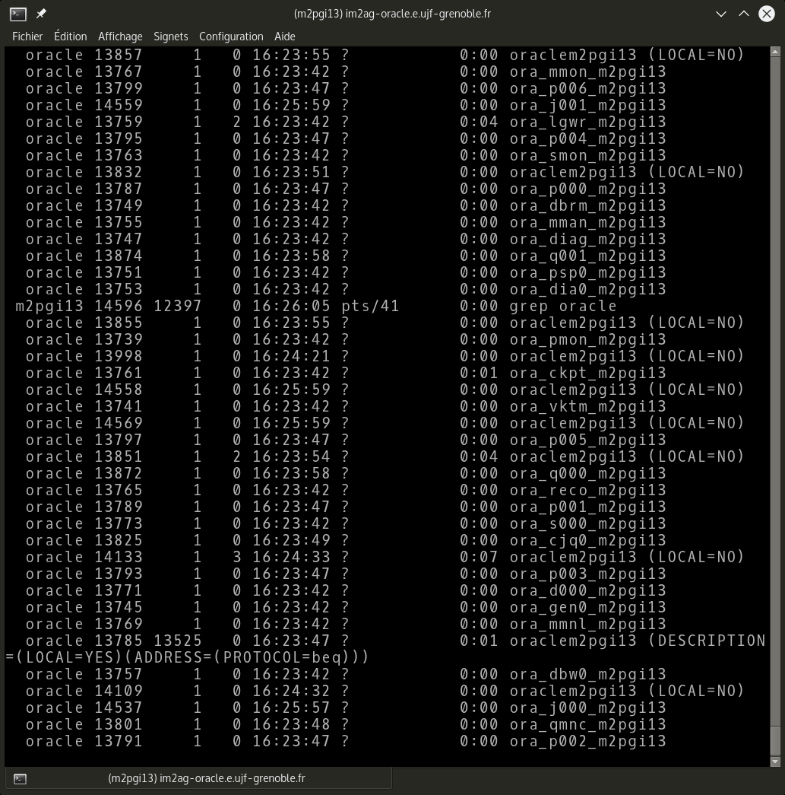

[M2PGI_TP_ORACLE] nom_nom.pdf

## 1. Démarrage de l'instance

##### a. Vérifier vos variables d'environnement liées à Oracle, expliquer leurs rôles brièvement.

Pour afficher les variables d'environnement liées à  Oracle, on peut utiliser la command linux :
```
> setenv | grep ORACLE

ORACLE_BASE=/oracle/TP_ADMIN_ORACLE_M2PGI/m2pgi13
ORACLE_HOME=/oracle/u01/11R2
ORACLE_SID=m2pgi13
```
On remarque trois variables globales:
* ORACLE_BASE : Le répertoire principal qui contient l'installation Oracle.
* ORACLE_HOME : Le répertoire home dans lequel un produit ou une base de données Oracle sont installés.
* ORACLE_SID : Utilisé pour identifier une instance/base oracle. Il doit être unique pour chaques instances.

##### b. Valider les procéduresde démarrage et d'arrêt de votre instance oracle.
##### c. Expliquer les bonnes pratiques à utiliser pour les comptes SYS et SYSTEM.

**connexion en admin :**

    > sqplus /nolog # Permet de lancer sqlplus sans essayer de se connecter
    > connect /as sysdba # Se connecter en admin pour avoir les bons privilèges

**demarrage :**

Une fois connecté à sqlplus avec les bons droits :

    > startup # Démarrage de l'instance

**Arrêt :**

Une fois connecté à sqlplus avec les bon droits :

    > shutdown abort # Arret violent de la base

Une description des différents types d'arrêt est disponible à cette adresse : [https://docs.oracle.com/cd/B28359_01/server.111/b28310/start003.htm](https://docs.oracle.com/cd/B28359_01/server.111/b28310/start003.htm)

## 2. Processus

##### a. Vérifier le fonctionnement de votre base en visualisant les processus de votre instance, commentaires sur ces processus détachés.

Dans le but d'afficher tous les processus vis-à-vis de notre instance Oracle, on utilise la command linux suivante :

    > ps -ef | grep oracle | grep m2pgi13



Les processus détachés Oracle permettent d'éxecuter des requêtes en tant que service.
Lors du démarrage, Oracle lance ses processus rattaché au processus init (ID : 1) du système d'exploitation. Cela permet de les détacher de la fênetre principal et ainsi les rendre complètement autonome. De plus il est necessaire de disposer de certain privilèges afin de tuer ces processus (voir Section 1).

##### b. Filiation des processus :

* Créer des connexions utilisateurs (par la commande sqlplus) avec l'utilisateur invité.

Une session oracle lancé et attaché au processus sqlplus en tant que Oracle.
Voici l'abre d'affiliation résultants d'une connexion sqlplus.

    .sshd
    └─sqlplus
        └─ oracleim2ag13 (LOCAL=YES [...])

Une fois qu'une commande est lancée dans sqlplus, Oracle prend la main et récupère la session en forkant le process de session puis execute la rêquete associée. La session utilisateur (processus créé suite à la connexion sqlplus) est peut être considérée comme une session tampon qui permet l'échange de données entre l'utilisateur et Oracle.

##### c. Expliquer le rôles des processus principaux liés à votre base.

## 3. Gestion des utilisateurs

##### a- Création d'utilisateurs
Pour créer les utilisateurs dans la base Oracle :
```
SQL> CREATE USER invite1 IDENTIFIED BY invite1;
SQL> CREATE USER invite2 IDENTIFIED BY invite2;
SQL> CREATE USER invite3 IDENTIFIED BY invite3;
```
On peut vérifier si les utilisateurs ont bien été créés avec :
```
SQL> SELECT * FROM USER;
```
##### b- Allocation des privilèges :

- Donner les droits nécessaires (rôles) aux utilisateurs pour se connecter à la base et créer des objets.

Lorsqu'un utilisateur est créé avec l'instruction CREATE USER, il ne dispose encore d'aucun droit car aucun privilège ne lui a encore été assigné. Il ne peut même pas se connecter à la base !
Pour qu'un utilisateur puisse se connecter à la base et créer des objets, il est nécéssaire de lui attribuer les privilèges nécessaires :
```
SQL> GRANT CONNECT, RESOURCE TO INVITE1, INVITE2, INVITE3;
```
- Expliquer ces rôles en retrouvant les privilèges qui leur sont associés.

Les privilèges système assignés au rôle CONNECT :
```
SQL> SELECT * FROM DBA_SYS_PRIVS WHERE grantee='CONNECT';
```
GRANTEE | PRIVILEGE | ADM
------------ | ------------- | -------------
CONNECT | CREATE SESSION | NO

* CREATE SESSION : Elle permet à un utilisateur de créer une connection à la base de données.

Les privilèges système assignés au rôle RESOURCE :

```
SQL> SELECT * FROM DBA_SYS_PRIVS WHERE grantee='RESOURCE';
```
GRANTEE | PRIVILEGE | ADM
------------ | ------------- | ------------
RESOURCE | CREATE TRIGGER | NO
RESOURCE | CREATE SEQUENCE | NO
RESOURCE | CREATE CLUSTER | NO
RESOURCE | CREATE TYPE | NO
RESOURCE | CREATE PROCEDURE | NO
RESOURCE | CREATE TABLE | NO
RESOURCE | CREATE INDEXTYPE | NO
RESOURCE | CREATE OPERATOR | NO

* CREATE TABLE : Elle permet à un utilisateur de créer une table qui appartiendera à ce dernier.

A noter qu'il possible d'attribuer directement des provilèges à un utilisateur sans passer par les rôles :

```
SQL> GRANT CREATE SESSION, CREATE TABLE TO INVITE1, INVITE2, INVITE3;
```
- Création d'un rôle manager_BDreparti avec les droits create synonym et create database link, attribuer ce rôle à invite3.

Lister les privilèges d'un rôle.
```
SQL> SELECT * FROM DBA_SYS_PRIVS WHERE GRANTEE ='MANAGER_BDREPARTI';
```

```
SQL> CREATE ROLE manager_BDreparti;
SQL> GRANT CREATE DATABASE LINK, CREATE SYNONYM TO manager_BDreparti;
SQL> GRANT manager_BDreparti TO INVITE3;
```

##### c- Modifier le mot de passe d'invite2 et lui donner le tablespace users par défaut.
```
SQL> ALTER USER invite2 IDENTIFIED BY invite;
```
```
ALTER USER invite2 IDENTIFIED BY invite2 DEFAULT TABLESPACE users;
```

ROLE ET PRIVILEGE :

http://oracle.developpez.com/guide/administration/adminrole/
https://docs.oracle.com/cd/E21901_01/timesten.1122/e21642/privileges.htm#TTSQL338

DATABASE STATE :

https://docs.oracle.com/cd/B28359_01/server.111/b28310/start002.htm

http://psoug.org/oraerror/ORA-00750.htm
Un fois la base dismounted, il faut la redemarrer.

## 4. Modification état de la base
##### a) Modifier la base pour qu'elle soit en mode maintenance.
Il faut se connecter en mode /nolog, puis :
```
SQL> shutdown abort # Virer toutes les connexions actives
```
Il est possible de démarrer la base en mode restreint. Ce dernier va permettre seulement aux utilisateurs titulaires de privilèges particuliers d'accèder à la base (par exemple, les utilisateur avec le rôle DBA).
```
SQL> startup restrict
```
Pour effectuer des opérations sur la base en tant qu'administrateur :
```
SQL> ALTER DATABASE CLOSE;
SQL> ALTER DATABASE DISMOUNT;
```
http://psoug.org/oraerror/ORA-00750.htm
Un fois la base dismounted, il faut la redemarrer.

##### b) Connexion à la base (via sqlplus) avec un des utilisateurs invité, constat ?
Quand on essaie de se connecter à la base avec un utilisateur ne disposant pas de privilèges suffisants (invite1 par exemple) :
```
ORA-01035: ORACLE only available to users with RESTRICTED SESSION privilege
```
##### c) Modifier l'état de la base en fonction pour permettre à l'utilisateur invité de se connecter à nouveau.
Pour enlever le mode restreint de la base :
```
SQL> alter system disable restricted session;
```

## 5. Gestion des ressources
##### a) Pour l'utilisateur invite1 retrouver ses informations (nom, status, tablespace par défaut, date de création).
```
SQL> SELECT * FROM SYS.DBA_USERS WHERE USERNAME = 'INVITE1';
```
##### b) Lancer plusieurs sessions sqplus pour vous connecter à la base sous des noms différents. retrouver à partir du dictionnaire des données les utilisateurs connectés (osuser et username), numéro de process (Processus) et le type de programme.
```
SELECT
  username,
  osuser,
  terminal
FROM
  v$session
WHERE
  username IS NOT null
ORDER BY
  username,
  osuser;
```
##### c) Un des utilisateurs consomme trop de ressources (sx: invite1), lui annuler sa session en récupérant son SID et serial number.
Lister les utilisateurs conncetés https://docs.oracle.com/cd/B19306_01/server.102/b14237/dynviews_2088.htm#REFRN30223
```
SELECT
SID, SERIAL#
FROM
  v$session
WHERE
  username IS NOT null
  and USERNAME='INVITE1'
ORDER BY
  username,
  osuser;
```
Puis pour annuler la session :
```
SQL> ALTER SYSTEM KILL SESSION '<SID,SERIAL#>';
```

##### d) Donner la commande pour verrouiller le compte de l'utilisateur invite1.
```
SQL> ALTER USER INVITE1 ACCOUNT LOCK;
```
Pour déverrouiller le compte de l'utilisateur invite1 :
```
SQL> ALTER USER INVITE1 ACCOUNT UNLOCK;
```

## 6. Administration de la base -- dictionnaire des données
##### a) Dans le dictionnaire des données, retrouver les valeurs des paramètres :
```
SQL> SELECT * FROM V$PARAMETER WHERE 
NAME = 'processes' OR 
NAME = 'shared_pool_size'OR 
NAME ='db_block_size' OR
NAME = 'db_name' OR 
NAME = 'undo_tablespace' OR 
NAME = 'nls_language';
```
Paramètre | Valeur
--------- | ---------
nombre de processus autorisés | 
taille maximum de la mémoire partagée | 
valeur par défaut des blocs | 
nom de la base | 
tablespace d'annulation | 
langage utilisé | 
##### b) Comparer ces données avec celles du fichier initSID.ora

##### c) Dans le dictionnaire des données, localiser sur votre base où se trouvent les fichiers de données, fichiers de contrôles et fichiers redo-log, vérifier  ces infos sur le système (im2ag-oracle.e.ujf-grenobleµ.fr).

##### d) Pour chaque tablespace de votre base retrouver son nom, son statut, la taille des blocs, l'extent initial et les fichiers associés.

##### e) Modifier en fonctionnement le nombre de process autorisés (=45), faites en sorte que cette modification soit effective immédiatement et au prochain redémarrage.

##### f) Expliquer et illustrer le principe de modication statique et dynamique des paramètres.

## 6. Tablespaces

##### a) Donner la rêquete visualisant la taille de tous les tablespaces de la base
##### b) Modification du tablespace users : ajouter 140 Mo au tablespaces users

##### c) Vérifier si votre base est en gestion automatique avec tablespace ou rollback segment, ajouter un tablespace pour les transactions de 50 Mo et l'activer comme tablespace d'annulation par défaut

##### d) Ajouter un tablespace USERS2 de 100 Mo géré en mode dictionnaire

##### e) Ajouter un tablespace USERS3 de 130 Mo, mode de gestion local et avec une taille de bloc de 32 Ko
